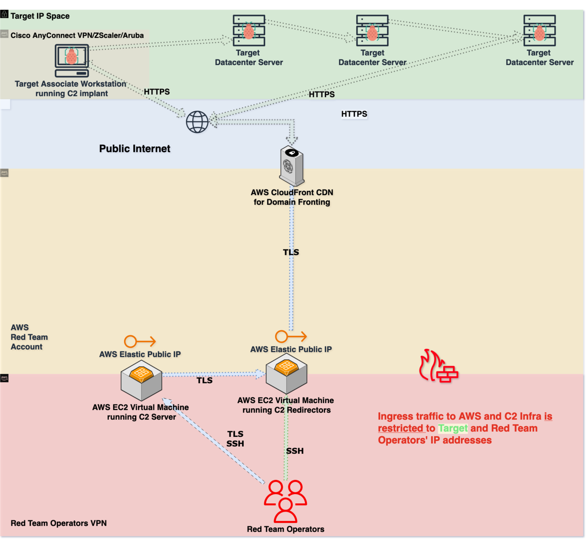

# New Skill Unlocked: C2 Infrastructure Automation

In this hands-on session, we'll demystify the process of deploying and configuring C2 components, such as frameworks, redirectors, and associated compute infrastructure.

You'll learn how to leverage infrastructure as code principles to create consistent, reliable, and secure C2 deployments, all while minimizing the risk of human error.

[Link to slides presented](https://docs.google.com/presentation/d/16QZhyyeSVlAqNl6Lin2Es68pUtSRrxMj/edit?usp=drive_link&ouid=113544216782604326804&rtpof=true&sd=true)

## Session goals

- Understand the components of a C2 infrastructure and how they work together
- Learn how to deploy, configure, and secure C2 components using automation
- Discover how to design and implement infrastructure as code for consistent and reliable deployments
- Implement operational security for C2 infrastructure
- Design scalable and easy-to-understand C2 deployment patterns

## Session overview

- Overview of components being deployed
- Architecture diagram
- Operationally secure configuration
  - Restricted ingress traffic
  - SSH/RSA key restriction
  - Redirection through VPN interface
  - C2 server has all ingress access restricted after configuring
- Scalability
  - Use of `count` attribute in Terraform allowing us to deploy multiple EC2 instances of each resource compatible with this method

## Requirements

- Windows virtual machine if you're using a macOS or Linux host. [Download a Windows virtual machine](https://developer.microsoft.com/en-us/windows/downloads/virtual-machines/)
- Terraform installed on your system. [See this documentation page for instructions](https://developer.hashicorp.com/terraform/install?ajs_aid=27f06833-e61f-422f-9656-921b533a86bb&product_intent=terraform)
- AWS Access Keys generated. [See this documentation page for instructions](https://docs.aws.amazon.com/IAM/latest/UserGuide/id_credentials_access-keys.html#Using_CreateAccessKey)
- AWS Access Keys configured. [See this documentation page for instructions](https://docs.aws.amazon.com/cli/v1/userguide/cli-authentication-user.html#cli-authentication-user-configure.title)
- Tailscale Auth Key to use in `tailscale` Ansible role. [See this documentation page for instructions](https://tailscale.com/kb/1085/auth-keys)